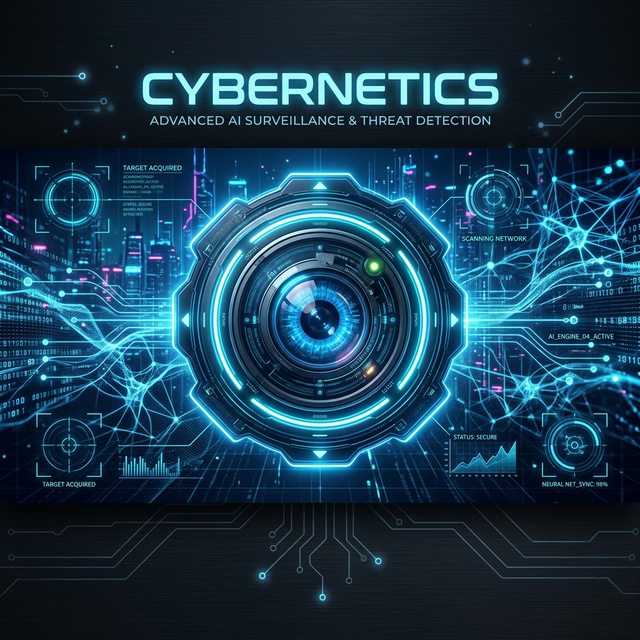

<div align="center">
  
  <h1>🤖 CYBERNETICS</h1>
  <p><i>Next-Generation AI-Powered Surveillance & Threat Detection</i></p>

  [](https://www.python.org/)
  [](https://yolov8.com/)
  [](https://opencv.org/)
  [](https://opensource.org/licenses/MIT)
</div>

---

## 🌟 Overview
**Cybernetics** is a high-performance, real-time surveillance system built with **YOLOv8**. It is designed to detect security threats, monitor overcrowding, and identify specific objects with surgical precision. Whether it's detecting weapons, fire, or tracking individuals, Cybernetics provides an intelligent layer of security for any environment.

## 🚀 Key Features
- **🎯 Real-Time Object Detection**: Detects weapons (guns, knives), fire, helmets, vehicles, and more.
- **🚨 Intelligent Alerts**: Automated audio alerts (beeps) when a threat is detected.
- **👥 Overcrowding Monitoring**: Automatically triggers an alert when the number of people exceeds a predefined threshold.
- **🛰️ Multi-Stream Support**: Works with webcams, video files, and live RTSP streams.
- **📈 Custom Trained Models**: Support for specialized models like `fire.pt` for dedicated fire detection.

## 🛠️ Tech Stack
- **AI Core**: YOLOv8 (Ultralytics)
- **Computer Vision**: OpenCV
- **Backend/Logic**: Python
- **Sound System**: `winsound` (Windows) / `beepy` (Linux/macOS)

## 📂 Project Structure
- `cybernetics.py`: Main tracking script using YOLOv8.
- `integration.py`: Surveillance script with person counting and sound alerts.
- `new.py`: Specialized detection for weapons, fire, and overcrowding with beep logic.
- `seprator.py`: Dataset management script for splitting data into train/val.
- `data.yaml`: Configuration for detection classes (9 classes including `robbery`, `weapon`, `fire`).

## ⚙️ Installation
1. **Clone the repository**:
   ```bash
   git clone https://github.com/codewithzodi/cybernetics.git
   cd cybernetics
   ```
2. **Install dependencies**:
   ```bash
   pip install ultralytics opencv-python beepy
   ```
3. **Ensure you have the weights**:
   The scripts expect `yolov8s.pt` or `yolov8m.pt` in the root directory.

## 🏃 Usage
- **Run Surveillance**:
  ```bash
  python integration.py
  ```
- **Run Threat Detection (Weapons/Fire)**:
  ```bash
  python new.py
  ```
- **Train/Evaluate**:
  Update `data.yaml` and use the Ultralytics CLI or `cybernetics.py`.

---

<p align="center">Made with ❤️ for a safer world.</p>
